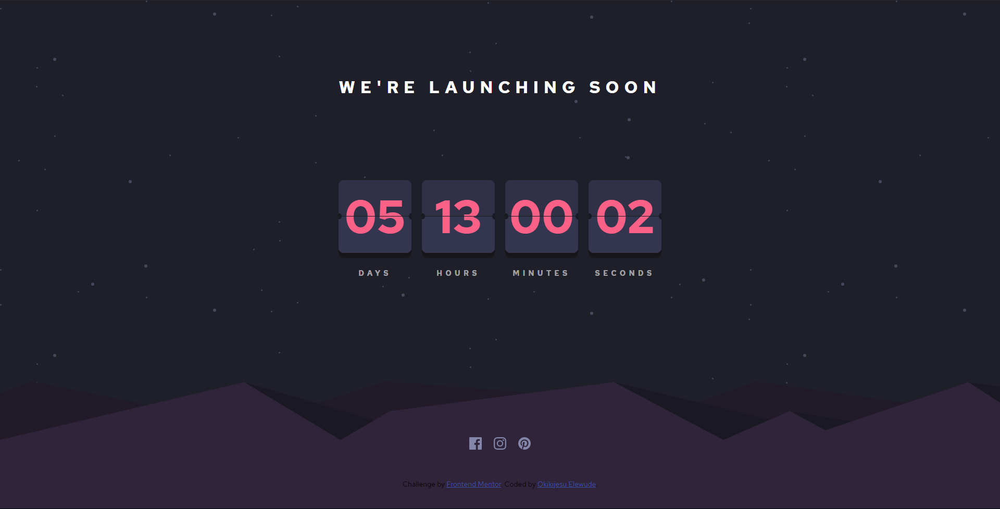

# Launch Countdown Timer

> A countdown timer created with HTML, CSS and Javascript

## Table of contents

- [General info](#general-info)
- [Screenshots](#screenshots)
- [Setup](#setup)
- [Features](#features)
- [Status](#status)
- [Inspiration](#inspiration)

## General info

Add more general information about project. What the purpose of the project is? Motivation?
This is a countdown timer to a preset date. This is a challenge by <frontendmentor.io>

## Screenshots

## Setup

Download the files locally to your computer, and click on the index file

## Features

To-do list:

- Add where to set the countdown timer
- Add toggle for dark and light mode

## Status

Project is: _in progress_

## Inspiration

[EL Creative Media](https://www.youtube.com/watch?v=ldEdYtW4Dtc&ab_channel=ELCreativeMedia)
